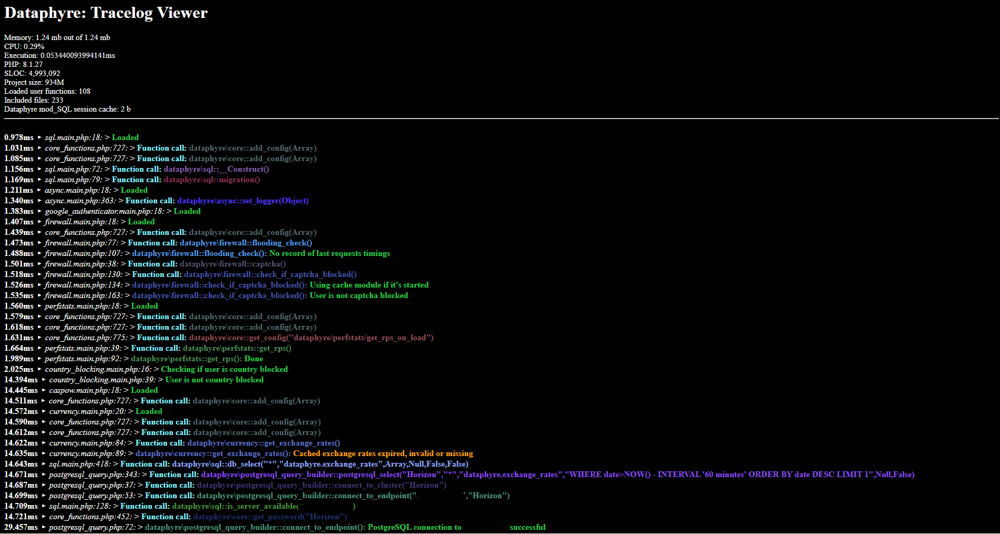
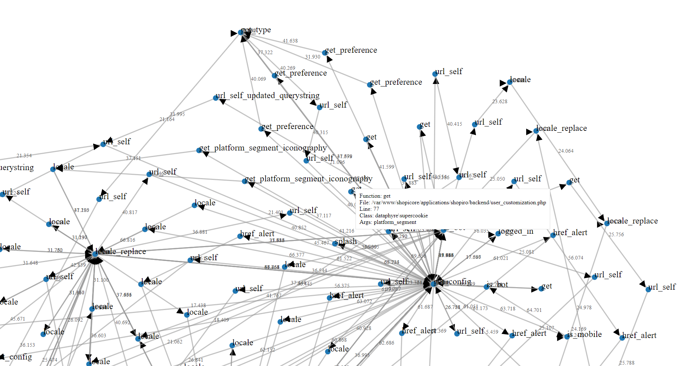

### Tracelog Module

The `Tracelog` module in Dataphyre provides robust logging and tracing capabilities, including error handling, profiling, and debugging functionalities. It captures function calls, error details, and performance metrics, which are stored in session variables or files based on configuration. This module is essential for debugging and analyzing the execution flow and performance of applications.

---

#### Configuration and Setup

1. **Configuration Files**: The module attempts to load configuration files from the common and application level dataphyre config folders.
   
   If no configuration is available, it triggers a `core::unavailable`.

2. **Session Integration**: At shutdown, the current session’s tracelog is saved into `$_SESSION['tracelog']` for persistence across page loads.

---

#### Class: `tracelog`

##### Static Properties

- **`$tracelog`**: Stores the generated tracelog entries as HTML for display or file output.
- **`$enable`**: Boolean to enable or disable tracing.
- **`$open`**: Manages the state of tracelog storage.
- **`$file`**: Defines the file path where tracelog data is stored if configured.
- **`$profiling`**: Boolean flag to enable profiling mode, which records performance metrics for each function call.
- **`$plotting`**: Boolean flag that, when enabled, saves trace data for further visualization.

---

#### Key Methods

##### `__construct()`
- Initializes the tracelog by starting a session if not already started.
- Calls `set_handler()` to register a custom error handler.

##### `set_handler()`
- Registers a custom error handler to catch PHP errors and warnings.
- On a critical error (e.g., memory limit reached), it logs the error and enters "safe mode" through `core::unavailable`.
- Formats and appends error information to `$tracelog` if tracing is enabled.

##### `tracelog()`
- **Parameters**:
  - `$filename_full`, `$line`, `$class`, `$function`, `$text`, `$type` (optional), `$arguments` (optional)
- **Purpose**: Logs trace information, including function calls and custom messages, along with timing and profiling information.
- **Process**:
  - Logs data to `$tracelog` in HTML format.
  - If `$plotting` is enabled, it writes trace data to `plotting.dat` for visualization.
  - If `$profiling` is enabled, it logs performance metrics to `profiling` files, organized by function and timestamp.
  - If `$file` is configured, it saves logs to HTML files in a `logs` directory, rotating based on configured lifespan.
- **Returns**: Boolean indicating success.

##### `setPlotting($value)`
- Enables or disables plotting mode.
- When enabled, it clears previous plotting data from `plotting.dat`.

##### `getPlotting()`
- Returns the current state of plotting mode.

---

#### Usage Examples

1. **Error Logging**:
   ```php
   tracelog::tracelog(__FILE__, __LINE__, __CLASS__, __FUNCTION__, "An error occurred", "fatal");
   ```

2. **Function Call Logging**:
   ```php
   tracelog::tracelog(__FILE__, __LINE__, __CLASS__, __FUNCTION__, "Processing request", "function_call", func_get_args());
   ```

3. **Enable Plotting**:
   ```php
   tracelog::setPlotting(true);
   ```

4. **Profiling Mode**:
   ```php
   tracelog::$profiling = true;
   ```

---

#### Additional Details

- **Plotting**: When `setPlotting(true)` is called, trace data is saved in `plotting.dat`, useful for visualizing the call stack and execution times.
- **Profiling**: With `$profiling` enabled, each function’s timing is logged, allowing for performance analysis.
- **File Output**: Logs can be stored in HTML format with rotating logs based on a lifespan configuration. The folder structure is based on date and time, ensuring organized logs.
- **Error Types**: Supports logging various error types:
  - **Info**: Default logging type with a green indicator.
  - **Warning**: Logs warnings in orange.
  - **Fatal**: Logs critical issues in red and saves to an error file.

This module is integral for debugging and performance optimization in Dataphyre applications, offering both real-time and persistent logging solutions.



