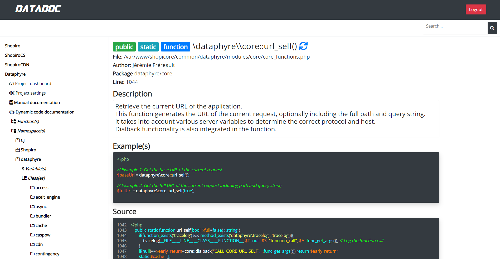

### Datadoc Module Documentation

The **Datadoc Module** within Dataphyre serves as a documentation manager and reference system, primarily for projects written in PHP. It supports structured project indexing, dynamic code documentation (Dynadoc), and filesystem-backed manual documentation (Manudoc). Project metadata, indexed code references, and synchronization state are stored in Dataphyre SQL tables.

#### Core Functionalities

1. **Authentication and Access Integration**
   - **`auth_context()`**: Resolves the active Datadoc authentication source.
   - **`logged_in()`**: Grants access through the authenticated Flightdeck console session.
   - **`login($password)`**: Delegates to Flightdeck authentication.
   - **`logout()`**: Clears the Flightdeck console session.

Datadoc requires the `flightdeck` module. Browser-facing Datadoc routes are Flightdeck-protected and no longer expose a separate Datadoc password/session path. If Flightdeck is not installed, DataDoc browser routes return unavailable instead of falling back to the previous standalone interface. The legacy Datadoc login file is only a compatibility redirect to the Flightdeck login route.

2. **Dynamic Documentation (Dynadoc)**
   - **`dynadoc_output_record($project, $record)`**: Formats a record for display as part of the dynamic documentation, linking elements like variables, functions, namespaces, and classes.
   - **`dynadoc_output_nested_structure($project, $data, $indentation, $currentPath)`**: Recursively builds the nested structure of Dynadoc, supporting collapsible sections for easy navigation.
   - **`dynadoc_insert_data(&$arr, $path, $value)`**: Inserts data into a specified path in an array, allowing the structured insertion of documentation entries.

3. **Manual Documentation (Manudoc)**
   - **`manudoc_output_record($record)`**: Formats and displays an individual manual-document entry.
   - **`manudoc_output_nested_structure_from_fs($data, $indentation)`**: Recursively generates the nested structure for filesystem-backed manual documents.

4. **URL and Routing Helpers**
   - **`index_url()`**: Returns the Datadoc landing page URL.
   - **`normalize_manual_path($path)`**: Normalizes a manual-document path from route segments or strings.
   - **`project_url($project, $suffix)`**: Builds project-scoped Datadoc URLs.

5. **Flightdeck Surfaces**
   - `/dataphyre/datadoc` manages DataDoc projects inside the Flightdeck shell, including project listing, discovered application registration, custom project creation, and sync actions.
   - `/dataphyre/datadoc/{project}` shows project metrics, stale files, and indexed records.
   - `/dataphyre/datadoc/{project}/settings` shows project paths and synchronization controls.
   - `/dataphyre/datadoc/{project}/dynadoc` renders an indexed dynamic code record with DataDoc highlighting and PHP reference links.
   - `/dataphyre/datadoc/{project}/manudoc/{document}` renders filesystem-backed manual documentation inside Flightdeck.

6. **Project and File Management**
   - **`create_project($name, $title, $path)`**: Creates a new project entry.
   - **`add_files_to_project($dirpath, $project)`**: Adds multiple files from a directory to a project, recursively processing subdirectories.
   - **`add_file_to_project($filepath, $project)`**: Adds a single file to a project and triggers synchronization.
   - **`discover_files_to_project($dirpath, $project, $limit, $after)`**: Lazily discovers PHP files, registers them as pending, and returns batch progress with a cursor.
   - **`register_file_to_project($filepath, $project)`**: Registers a PHP file as pending without synchronizing it immediately.
   - **`delete_file($filepath, $project)`**: Removes a file and its associated documentation records from the project.
   - **`sync_all_files($project)`**: Synchronizes all files in a project and updates stale markers. This remains available for compatibility, but Flightdeck uses bounded batches for browser actions.
   - **`sync_project_batch($project, $limit, $max_seconds)`**: Synchronizes a bounded number of pending files within a request-time budget and returns introspectable counters.
   - **`sync_file($file, $project)`**: Re-indexes a single file and stores its extracted code elements.

The Flightdeck DataDoc landing page intentionally does not show a separate authentication card. Authentication is owned by the Flightdeck shell; DataDoc management focuses on projects, applications, records, and synchronization state. Create/sync actions are protected by the Flightdeck CSRF token and only operate on paths inside the current Dataphyre project roots.

Flightdeck indexing is intentionally lazy. `Start Index` runs a bounded discovery batch, marks discovered PHP files as pending, synchronizes a small batch, then shows progress and a `Continue Indexing` action. This avoids exceeding `max_execution_time` and keeps indexing state visible through known-file, pending-sync, record, cursor, and batch counters.

DataDoc's project, file-registry, and token-record writes are compatible with older installs whose tables predate the current unique constraints. The diagnostic schema still declares the preferred uniqueness rules, but lazy browser indexing uses explicit select/update/insert/delete flows instead of requiring PostgreSQL `ON CONFLICT` targets to exist.

7. **Reference and Rendering Helpers**
   - **`reference_functions($content, $current_project, $current_class)`**: Scans content for references to classes, functions, and namespaces within a project and creates links for these references.
   - **`get_project($name)`**: Loads a Datadoc project definition from storage.
   - **`get_manudoc($project, $path)`**: Loads a manual document from the filesystem-backed Manudoc store.

### Summary

The Datadoc module supports documentation creation and synchronization for PHP projects, helping manage references to variables, functions, classes, and namespaces within a project. It provides Dynadoc for dynamic, automated documentation and Manudoc for manually structured documentation, storing metadata and content in Dataphyre SQL tables and filesystem-backed manual documents for efficient reference and retrieval. Datadoc is part of the Flightdeck control plane and uses Flightdeck authentication for browser-facing access.
