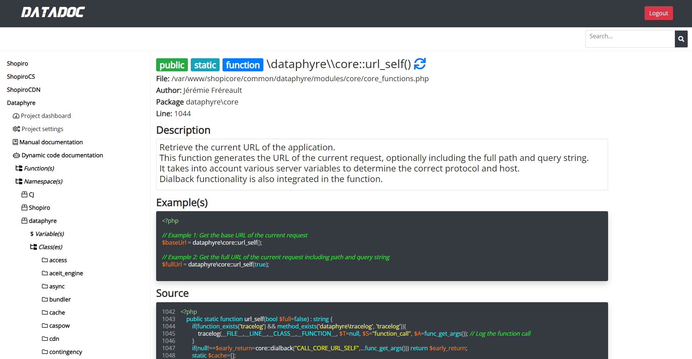

### Datadoc Module Documentation

The **Datadoc Module** within Dataphyre owns the framework-wide documentation engine. It supports structured PHP project indexing, dynamic code documentation (Dynadoc), filesystem-backed manual documentation (Manudoc), and dependency-free static portal publication from normalized Markdown corpora. Project metadata, indexed code references, and synchronization state use Dataphyre SQL tables; the static portal API is deterministic and does not require SQL, Flightdeck, Panel, or a running application.

#### Core Functionalities

1. **Authentication and Access Integration**
   - **`auth_context()`**: Resolves the active Datadoc authentication source.
   - **`logged_in()`**: Grants access through the authenticated Flightdeck console session.
   - **`login($password)`**: Delegates to Flightdeck authentication.
   - **`logout()`**: Clears the Flightdeck console session.

Datadoc's interactive control-plane routes require the `flightdeck` module. Browser-facing Datadoc routes are Flightdeck-protected and no longer expose a separate Datadoc password/session path. If Flightdeck is not installed, Datadoc browser routes return unavailable instead of falling back to the previous standalone interface. The legacy Datadoc login file is only a compatibility redirect to the Flightdeck login route. Static portal builds and publications remain available without Flightdeck.

2. **Universal Static Documentation Portal**
   - **`DocumentationCorpus`**: Discovers or composes bounded root-confined Markdown and inert raster sources. Workspace mode preserves repository-relative paths, discovers every module documentation directory without loading module code, generates the root catalog, and prevents publication self-ingestion.
   - **`DocumentationPortal`**: Renders a bounded, normalized Markdown corpus into self-contained HTML, navigation, local search, version metadata, accessibility-aware assets, and strict browser security policy.
   - **`DocumentationPortalBuild`**: Holds the immutable, integrity-checked generated artifact map and portal manifest.
   - **`DocumentationPortalPublication`**: Wraps one build in a canonical SemVer release, adds `publication.json`, previews safely, and writes a complete version directory atomically.
   - **`DocumentationPortalWriteResult`**: Describes previewed, applied, or byte-identical publication outcomes without leaking source content.
   - **`source-checkout-maintainer-tool`**: Publishes either a manually mounted corpus or the automatically discovered Dataphyre workspace through Datadoc. It is preview-first and writes only when `--write` is explicit.

Datadoc owns rendering, search, navigation, theming, static assets, release integrity, and publication behavior. Product modules own only their source corpus and adapter. For example, Panel can produce API and cookbook Markdown and pass it through `PanelDocumentationPortal`; Panel does not own or fork the portal engine. See [Static Portal and Publication](Dataphyre_Datadoc_Static_Portal.md) for the complete contract.

3. **Dynamic Documentation (Dynadoc)**
   - **`dynadoc_output_record($project, $record)`**: Formats a record for display as part of the dynamic documentation, linking elements like variables, functions, namespaces, and classes.
   - **`dynadoc_output_nested_structure($project, $data, $indentation, $currentPath)`**: Recursively builds the nested structure of Dynadoc, supporting collapsible sections for easy navigation.
   - **`dynadoc_insert_data(&$arr, $path, $value)`**: Inserts data into a specified path in an array, allowing the structured insertion of documentation entries.

4. **Manual Documentation (Manudoc)**
   - **`manudoc_output_record($record)`**: Formats and displays an individual manual-document entry.
   - **`manudoc_output_nested_structure_from_fs($data, $indentation)`**: Recursively generates the nested structure for filesystem-backed manual documents.

5. **URL and Routing Helpers**
   - **`index_url()`**: Returns the Datadoc landing page URL.
   - **`normalize_manual_path($path)`**: Normalizes a manual-document path from route segments or strings.
   - **`project_url($project, $suffix)`**: Builds project-scoped Datadoc URLs.

6. **Flightdeck Surfaces**
   - `/dataphyre/datadoc` manages DataDoc projects inside the Flightdeck shell, including project listing, discovered application registration, custom project creation, and sync actions.
   - `/dataphyre/datadoc/{project}` shows project metrics, stale files, and indexed records.
   - `/dataphyre/datadoc/{project}/settings` shows project paths and synchronization controls.
   - `/dataphyre/datadoc/{project}/dynadoc` renders an indexed dynamic code record with DataDoc highlighting and PHP reference links.
   - `/dataphyre/datadoc/{project}/manudoc/{document}` renders filesystem-backed manual documentation inside Flightdeck.

7. **Project and File Management**
   - **`create_project($name, $title, $path)`**: Creates a new project entry.
   - **`add_files_to_project($dirpath, $project)`**: Adds multiple files from a directory to a project, recursively processing subdirectories.
   - **`add_file_to_project($filepath, $project)`**: Adds a single file to a project and triggers synchronization.
   - **`discover_files_to_project($dirpath, $project, $limit, $after)`**: Lazily discovers PHP files, registers them as pending, and returns batch progress with a cursor.
   - **`register_file_to_project($filepath, $project)`**: Registers a PHP file as pending without synchronizing it immediately.
   - **`delete_file($filepath, $project)`**: Removes a file and its associated documentation records from the project.
   - **`sync_all_files($project)`**: Synchronizes all files in a project and updates stale markers. This remains available for compatibility, but Flightdeck uses bounded batches for browser actions.
   - **`sync_project_batch($project, $limit, $max_seconds)`**: Synchronizes a bounded number of pending files within a request-time budget and returns introspectable counters.
   - **`sync_file($file, $project)`**: Re-indexes a single file and stores its extracted code elements.

The Flightdeck DataDoc landing page intentionally does not show a separate authentication card. Authentication is owned by the Flightdeck shell; DataDoc management focuses on projects, applications, records, and synchronization state. Create/sync actions are protected by the Flightdeck CSRF token and only operate on paths inside the current Dataphyre project roots.

Flightdeck indexing is intentionally lazy. `Start Index` runs a bounded discovery batch, marks discovered PHP files as pending, synchronizes a small batch, then shows progress and a `Continue Indexing` action. This avoids exceeding `max_execution_time` and keeps indexing state visible through known-file, pending-sync, record, cursor, and batch counters.

DataDoc's project, file-registry, and token-record writes are compatible with older installs whose tables predate the current unique constraints. The diagnostic schema still declares the preferred uniqueness rules, but lazy browser indexing uses explicit select/update/insert/delete flows instead of requiring PostgreSQL `ON CONFLICT` targets to exist.

8. **Reference and Rendering Helpers**
   - **`reference_functions($content, $current_project, $current_class)`**: Scans content for references to classes, functions, and namespaces within a project and creates links for these references.
   - **`get_project($name)`**: Loads a Datadoc project definition from storage.
   - **`get_manudoc($project, $path)`**: Loads a manual document from the filesystem-backed Manudoc store.

### Summary

The Datadoc module is the documentation boundary for Dataphyre as a whole. Dynadoc indexes PHP symbols, Manudoc serves filesystem-backed manuals, and the static portal engine turns producer-neutral Markdown into immutable deployable releases. Flightdeck owns authentication for interactive control-plane access; static generation and publication remain framework APIs with no Panel or Flightdeck dependency.
