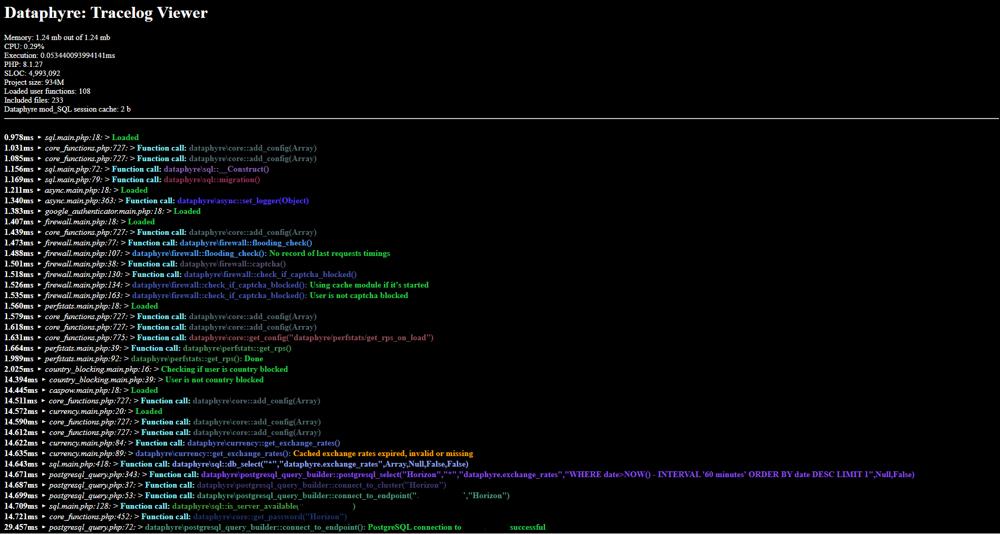
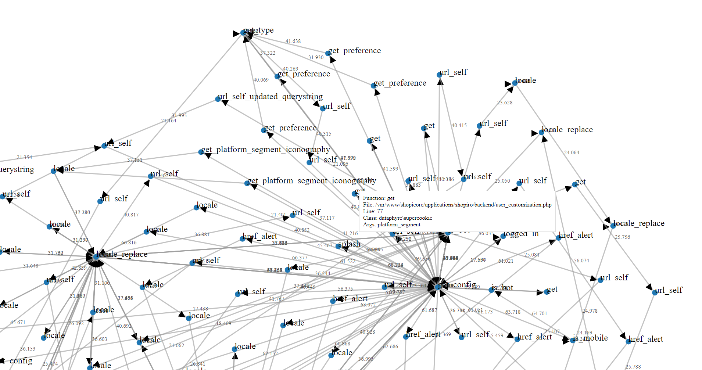

### Tracelog Module

The `Tracelog` module captures Dataphyre runtime diagnostics for Flightdeck,
dynamic unit-test discovery, error reporting, and optional call-graph plotting.
Framework code should instrument through the global `tracelog()` shim so early
bootstrap events, legacy call shapes, production suppression, deferred buffers,
and the constructed `dataphyre\tracelog` backend all follow one path.



---

#### Flightdeck Interface

Tracelog's browser UI is embedded in Dataphyre Flightdeck:

- `/dataphyre/tracelog` renders session trace metrics and the captured trace buffer through the Flightdeck shell.
- `/dataphyre/tracelog/plotter` renders the D3 call-graph plotter inside Flightdeck instead of returning a standalone HTML document.

Flightdeck owns authentication, layout, navigation, and visual framing. Tracelog still owns the trace data, plotting file, and runtime instrumentation.

---

#### Configuration and Setup

1. **Configuration Files**: The module loads readonly config from:

   - `common/dataphyre/config/tracelog.php`
   - `applications/<app>/backend/dataphyre/config/tracelog.php`
   - `applications/<app>/backend/dataphyre/cache/config/tracelog.compiled.php`

   The owning kernel exposes the merged config as `DP_TRACELOG_CFG`. If no file exists, the kernel defaults still provide a safe baseline.

2. **Session Integration**: At shutdown, the current session's tracelog is saved into `$_SESSION['tracelog']` for persistence across page loads.
3. **Flightdeck Handoff**: When the tracing popup is opened, Tracelog persists the buffer during `buffer_callback()` as well as shutdown. This prevents the Flightdeck viewer request from racing the shutdown writer. Flightdeck also retains the last rendered trace in `$_SESSION['flightdeck_last_tracelog']` so a refresh does not immediately show an empty buffer after consuming the fresh trace. As a fallback, Tracelog writes the handoff under `cache/tracelog_handoff/` using both the PHP session id and the Flightdeck auth cookie as lookup keys, then passes a signed `handoff` token to the Flightdeck popup URL so the viewer can read the exact trace file even if its PHP session id changed. If those keys are unavailable, the authenticated Flightdeck view falls back to the newest retained handoff file.

---

#### Usage Contract

Use the global helper for module/runtime instrumentation:

```php
tracelog(__FILE__, __LINE__, __CLASS__, __FUNCTION__, $T='Message', $S='info');
tracelog(__FILE__, __LINE__, __CLASS__, __FUNCTION__, $T=null, $S='function_call', $A=func_get_args());
tracelog(__FILE__, __LINE__, __CLASS__, __FUNCTION__, $T=null, $S='function_call_with_test', $A=func_get_args());
```

The canonical argument order is:

```php
tracelog($file, $line, $class, $function, $text, $type, $arguments);
```

The common local variable names are historical:

- `$T` is message text.
- `$S` is severity or event type.
- `$A` is the argument payload, usually `func_get_args()` for non-sensitive
  functions and `null` for sensitive calls.

Use `function_call` for trace-only function entry markers. Use
`function_call_with_test` only when the function is suitable for dynamic unit
test discovery. Use `warning`, `error`, or `fatal` for exceptional conditions,
and avoid logging secrets, tokens, credentials, cookies, private keys, full
request bodies, or tenant-private data. Functions with `#[SensitiveParameter]`
should use `function_call` and omit the argument payload instead of passing raw
`func_get_args()`. Functions whose arguments include callables, closures, or
arrays of callables should also avoid `function_call_with_test` and raw argument
payloads because those values are not replayable dynamic-test inputs.

The static backend dispatcher exists for the runtime pipeline. Prefer the
global helper in framework modules unless you are inside the Tracelog backend
itself.

#### Class: `tracelog`

##### Static Properties

- **`$tracelog`**: Stores generated trace entries as HTML for display.
- **`$enable`**: Boolean to enable or disable tracing.
- **`$open`**: Controls whether the Flightdeck viewer popup is launched from the response buffer.
- **`$constructed`**: Tracks whether the backend has been initialized.
- **`$plotting`**: Boolean flag that, when enabled, writes call-graph frame data for the plotter.
- **`$dynamic_unit_testing`**: Tracks dynamic unit-test capture state.
- **`$defer`**: Defers trace formatting until retroactive bootstrap rows are drained.
- **`$save_to_sql`**: Enables shutdown persistence into the tracelog SQL table.

---

#### Key Methods

##### `__construct()`
- Initializes the backend.
- Calls `set_handler()` to register a custom error handler.

##### `set_handler()`
- Registers a custom error handler to catch PHP errors and warnings.
- On a critical error (e.g., memory limit reached), it logs the error and enters "safe mode" through `core::unavailable`.
- Formats and appends error information to `$tracelog` if tracing is enabled.

##### `tracelog()`
- **Parameters**:
  - `$file`, `$line`, `$class`, `$function`, `$text`, `$type` (optional), `$arguments` (optional)
- **Purpose**: Logs trace information, including function calls and custom messages, along with timing and memory deltas.
- **Process**:
  - Logs data to `$tracelog` in HTML format.
  - If `$plotting` is enabled, writes trace frame data for visualization.
  - Defers early events until the backend drains the retroactive bootstrap buffer.
  - Trims large buffers to protect request memory.
- **Returns**: Boolean indicating success.

##### `set_plotting($value)`
- Enables or disables plotting mode.
- When enabled, clears the previous plotting cache file.

---

#### Usage Examples

1. **Error Logging**:
   ```php
   tracelog(__FILE__, __LINE__, __CLASS__, __FUNCTION__, $T='An error occurred', $S='fatal');
   ```

2. **Function Call Logging**:
   ```php
   tracelog(__FILE__, __LINE__, __CLASS__, __FUNCTION__, $T=null, $S='function_call', $A=func_get_args());
   ```

3. **Enable Plotting**:
   ```php
   \dataphyre\tracelog::set_plotting(true);
   ```

---

#### Additional Details

- **Plotting**: When `set_plotting(true)` is called, trace frame data is written for the call-graph plotter.
- **Session and Handoff Output**: Traces are stored in session-safe form and, when needed, as signed handoff files for Flightdeck.
- **Error Types**: Supports logging various error types:
  - **Info**: Default logging type with a green indicator.
  - **Warning**: Logs warnings in orange.
  - **Error**: Logs recoverable errors in pink.
  - **Fatal**: Logs critical issues in red and saves to an error file.

This module is integral for debugging and performance optimization in Dataphyre applications, offering both real-time and persistent logging solutions.


